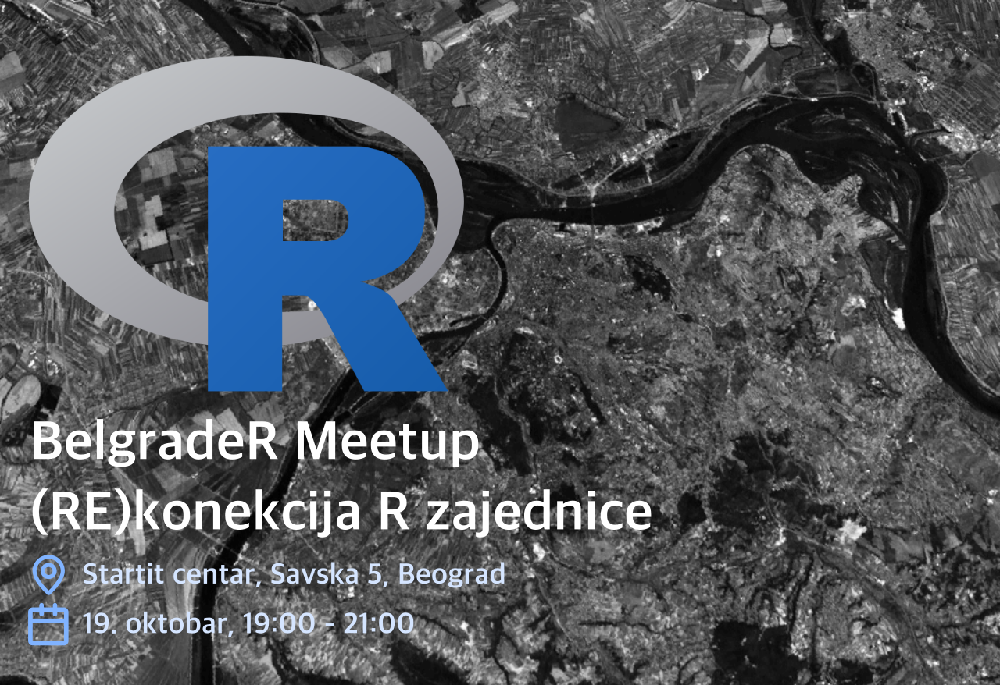

# BelgradeRMeetup
BelgradeR Meetup

This is a GitHub repo of the [BelgradeR Meetup](https://www.meetup.com/BelgradeR) group: a Belgrade and Serbian R Community gathering.

The repository is hosted at [DataKolektiv](https://github.com/datakolektiv); how many, contributors may be many and diverse. We are open to collaboration with anyone of good will and good R skills in the local community. 