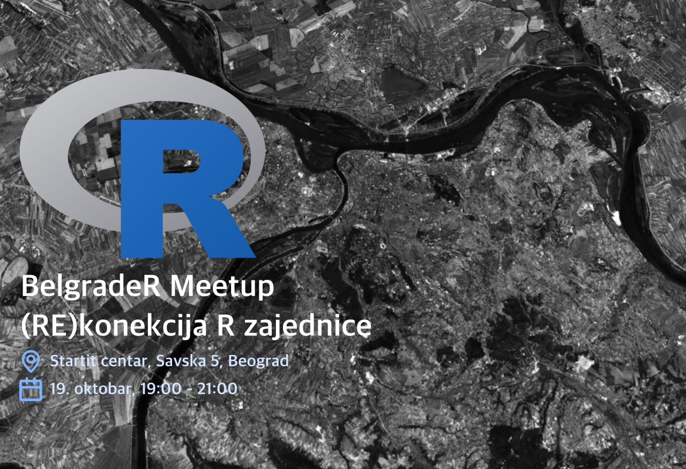
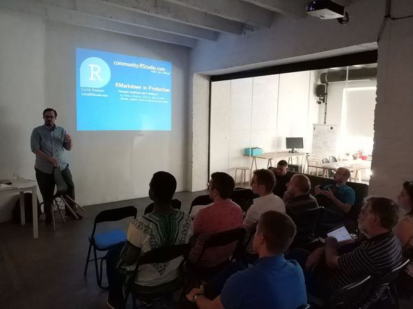

BelgradeR Meetup #00
========================================================
author: Goran S. Milovanović
date: Wed 19 Oct 2022
autosize: true

&nbsp;

BelgradeR #00 Wed 19 Oct 2022
========================================================

BelgradeR #00 Wed 19 Oct 2022
========================================================

# Welcome!!!

## Why are we here today?

- To reconnect, meet old friends and make new ones!
- To remind ourselves how cool R is and talk about its future.
- To study some recent developments in R.
- To discuss the future of [BelgradeR](https://www.meetup.com/belgrader).
- To announce a forthcoming free [Intro to R course](http://datakolektiv.com/app_direct/uvodr) with [Startit](https://startit.rs) and [DataKolektiv](http://www.datakolektiv.com/app_direct/DataKolektivServer) (and see who wants to take part in volunteering to teach it!)
- Networking (i.e. Party!)

BelgradeR #00 Wed 19 Oct 2022
========================================================

# R is getting more and more popular!

### Source: The PYPL PopularitY of Programming Language Index

The [PYPL PopularitY of Programming Language Index](https://pypl.github.io/PYPL.html) is created by analyzing how often language tutorials are searched on Google.

Dataset: [Kaggle](https://www.kaggle.com/datasets/muhammadkhalid/most-popular-programming-languages-since-2004)

BelgradeR #00 Wed 19 Oct 2022
========================================================

|Date           | Abap|  Ada| C/C++|   C#| Cobol| Dart| Delphi/Pascal| Go| Groovy|
|:--------------|----:|----:|-----:|----:|-----:|----:|-------------:|--:|------:|
|July 2004      | 0.34| 0.36| 10.08| 4.71|  0.43|    0|          2.82|  0|   0.03|
|August 2004    | 0.36| 0.36|  9.81| 4.99|  0.46|    0|          2.67|  0|   0.07|
|September 2004 | 0.41| 0.41|  9.63| 5.06|  0.51|    0|          2.65|  0|   0.08|
|October 2004   | 0.40| 0.38|  9.50| 5.31|  0.53|    0|          2.77|  0|   0.09|
|November 2004  | 0.38| 0.38|  9.52| 5.24|  0.55|    0|          2.76|  0|   0.07|
|December 2004  | 0.36| 0.37|  9.56| 5.23|  0.53|    0|          2.77|  0|   0.09|

BelgradeR #00 Wed 19 Oct 2022
========================================================

&nbsp;

BelgradeR #00 Wed 19 Oct 2022 :: Startit, BGD
========================================================

&nbsp;

BelgradeR #00 Wed 19 Oct 2022
========================================================

# Our R Scene

- [BelgradeR](https://www.meetup.com/belgrader/), 2016, mainly Kovac (founder) & Milovanovic w. support from [Data Science Serbia](https://datascience.rs/)
- Several Intro to R courses w. Startit in Belgrade, Novi Sad, and online
- [R-Ladies Belgrade meetups](https://www.meetup.com/rladies-belgrade/), Tatjana Kecojevic & Friends
- [SatRdays](https://belgrade2018.satrdays.org/), Belgrade, 2018, MNT, Branko Kovac
- Milovanovic presents his [work in R with Wikidata @eRum 2018, Budapest](https://www.youtube.com/watch?v=R4dKyqNyrL8)

BelgradeR #00 Wed 19 Oct 2022
========================================================

# Our R Scene

- Milovanovic [@MilanoR, 2019: Information Retrieval: Semantic Web Technologies and Wikidata from R](https://github.com/datakolektiv/MilanoR2019)
- Kovac and Milovanovic members of the programme committee @Rum 2020, Milano
- Milovanovic [@eRum 2020, Milano: Semantic Web in R for Data Scientists](https://github.com/datakolektiv/e-Rum2020_SemanticWeb)

BelgradeR #00 Wed 19 Oct 2022
========================================================

BelgradeR #00 Wed 19 Oct 2022
========================================================

BelgradeR #00 Wed 19 Oct 2022
========================================================

BelgradeR #00 Wed 19 Oct 2022
========================================================

BelgradeR #00 Wed 19 Oct 2022
========================================================

BelgradeR #00 Wed 19 Oct 2022
========================================================

BelgradeR #00 Wed 19 Oct 2022
========================================================

BelgradeR #00 Wed 19 Oct 2022
========================================================

BelgradeR #00 Wed 19 Oct 2022
========================================================

BelgradeR #00 Wed 19 Oct 2022
========================================================

BelgradeR #00 Wed 19 Oct 2022
========================================================

BelgradeR #00 Wed 19 Oct 2022
========================================================

BelgradeR #00 Wed 19 Oct 2022
========================================================

BelgradeR #00 Wed 19 Oct 2022
========================================================

BelgradeR #00 Wed 19 Oct 2022
========================================================

## DataKolektiv R Language Community Support

### - Professional [GitHub for BelgradeR](https://github.com/datakolektiv/BelgradeRMeetup/tree/main/belgrader_00)
### - Free [Introductory R courses](http://datakolektiv.com/app_direct/uvodr/) w. Startit
### - Computational resources for researchers (academic and non-academic): 
   - up to 128GB RAM, 4Tb SSD, 12(24) AMD cores.

